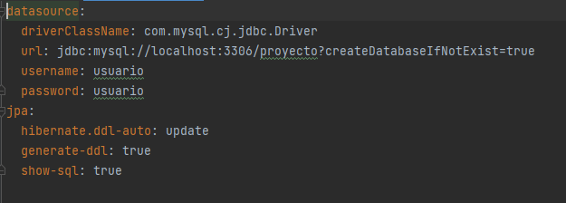
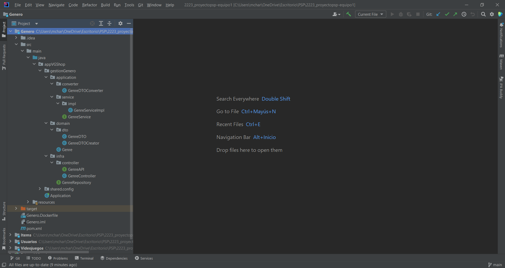
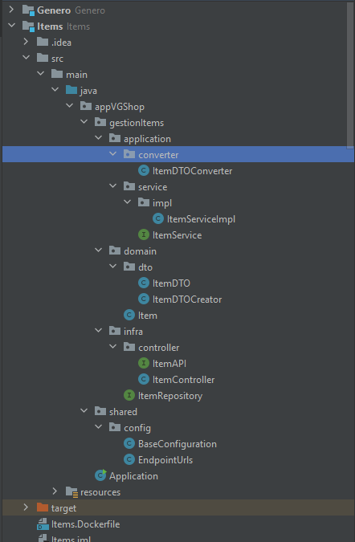
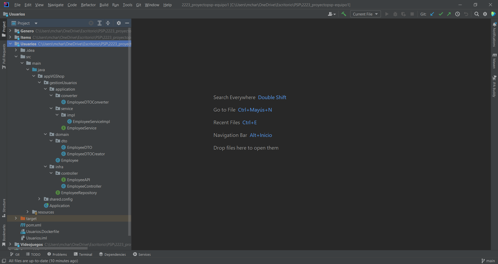
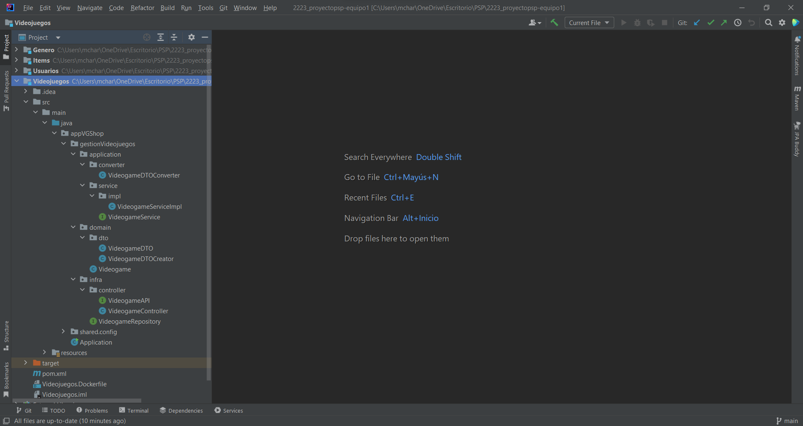

# Documentación del proyecto
Equipo 1

Año: 2022-2023

Módulo: PSP

## [Codificación-3] Microservicios

### Cambios mayores

* Reestructuración de las gestiones para mayor comprensibilidad.
* Separación de las gestiones en distintos microservicios.

### Configuración de microservicios

Mostrando la configuración de cada application.yml

#### GESTIÓN DE EMPLEADOS

#### GESTIÓN DE GÉNEROS

#### GESTIÓN DE VIDEOJUEGOS

#### GESTIÓN DE ITEMS

### Comparativa de estructura

#### PREVIA ESTRUCTURA

Todos en el mismo proyecto, funcionando como una sola aplicación Spring.

#### ESTRUCTURA ACTUAL

Dividida en distintos proyectos, mostrado aquí en la misma carpeta.

(Captura hecha por Adan, por el nombre del repositorio, este chaval....)

### Docker-compose
    
* Primero ponemos la version que es, en nuestro caso la 3.

* Luego creamos un service para todos los microservicios

* Por cada microservicio asociamos una imagen que esta subida al repositorio de Miguel, un nombre al contenedor, unos puertos, una dependencia a base de datos y unas variables de entorno para declarar el usuario, password y url de la base de datos, en nuestro caso MYSQL.

* Lo unico que debe cambiar por cada microservicio son los puertos que deben ser diferentes.

    version: '3'
    services:
    usuarios:
    image: 'miguelchaves/proyectopsp-equipo1:Usuarios'
    container_name: microservicios-usuarios
    environment:
    spring.datasource.url: jdbc:mysql://microservicios-db:3306/proyecto
    spring.datasource.username: usuario
    spring.datasource.password: usuario
    ports:
    - "8080:8080"
    depends_on:
      - db
      links:
      - db
      videojuegos:
      image: 'miguelchaves/proyectopsp-equipo1:Videojuegos'
      container_name: microservicios-videojuegos
      environment:
      spring.datasource.url: jdbc:mysql://microservicios-db:3306/proyecto
      spring.datasource.username: usuario
      spring.datasource.password: usuario
      ports:
      - "8081:8081"
      depends_on:
      - db
      links:
      - db
      items:
      image: 'miguelchaves/proyectopsp-equipo1:Items'
      container_name: microservicios-items
      environment:
      spring.datasource.url: jdbc:mysql://microservicios-db:3306/proyecto
      spring.datasource.username: usuario
      spring.datasource.password: usuario
      ports:
      - "8082:8082"
      depends_on:
      - db
      links:
      - db
      generos:
      image: 'miguelchaves/proyectopsp-equipo1:Genero'
      container_name: microservicios-generos
      environment:
      spring.datasource.url: jdbc:mysql://microservicios-db:3306/proyecto
      spring.datasource.username: usuario
      spring.datasource.password: usuario
      ports:
      - "8083:8083"
      depends_on:
      - db
      links:
      - db
      db:
      image: mysql:latest
      container_name: microservicios-db
      environment:
      MYSQL_ROOT_PASSWORD: root
      MYSQL_USER: usuario
      MYSQL_PASSWORD: usuario
      MYSQL_DATABASE: proyecto
      ports:
      - "3306:3306"

#### UTILIZACIÓN

### Pruebas de funcionamiento

#### GESTIÓN DE GÉNEROS

Viendo todos los géneros:

#### GESTIÓN DE VIDEOJUEGOS

Mostrando todos los juegos:

#### GESTIÓN DE ITEMS

Mostrando todos los items:

