# Documentación del Proyecto
Equipo 1

Año: 2022-2023

Módulo: PSP

## [Codificación-3 Etapa-3] Microservicios: Uso de Clientes Estándar

### Cambios Mayores

* Actualización en las clases EmployeeService y EmployeeServiceImpl añadiendo el método notifyGmail() que tiene dos parámetros de entrada (String header y String body) que envía un correo al dar de alta, actualizar y dar de baja a un usuario.

### Explicación del Código

#### Comandos SMTP

* Se crea un cliente SMTP seguro. 

###### AuthenticatingSMTPClient client = new AuthenticatingSMTPClient();

* Se crea un par de claves para establecer un canal seguro.

###### KeyManagerFactory kmf = KeyManagerFactory.getInstance(KeyManagerFactory.getDefaultAlgorithm());
###### kmf.init(null, null);
###### KeyManager km = kmf.getKeyManagers() [0];

* Nos conectamos al servidor SMTP (smtp.gmail.com) desde el puerto 587.

###### client.connect(server, puerto);

* Se establece la clave para la comunicación segura.

###### client.setKeyManager(km);

* Enviamos el comando "EHLO" para abrir una sesión con el servidor.

###### client.ehlo(server);

* Se establece la negociación TLS de manera no implícita ejecutando el comando STARTLS.

###### if (client.execTLS())

* Se realiza la autenticación con el servidor con nuestro correo y nuestra contraseña.

###### if (client.auth(AuthenticatingSMTPClient.AUTH_METHOD.PLAIN, username, password)) {

* Se crea la cabecera del correo con el remitente, el destino y el asunto.

###### SimpleSMTPHeader cabecera = new SimpleSMTPHeader(remitente, destino1, asunto);

* Ponemos la dirección de correo del remitente con lo equivalente al comando "MAIL FROM" y las de destino con lo equivalente al comando "RCPT TO".

###### client.setSender(remitente);
###### client.addRecipient(destino1);
###### String destino2 = "jlrod2pruebas@gmail.com";
###### client.addRecipient(destino2);

* Se envía el contenido del mensaje con lo equivalente al comando "DATA" con un writer.

###### Writer writer = client.sendMessageData();

* Se comprueba que el correo se haya enviado correctamente.

###### boolean exito = client.completePendingCommand();
###### if (!exito)

### Pruebas de Funcionamiento

Primero probaremos la inserción de datos, para ello mediante el ARC o Postman insertaremos un nuevo empleado.

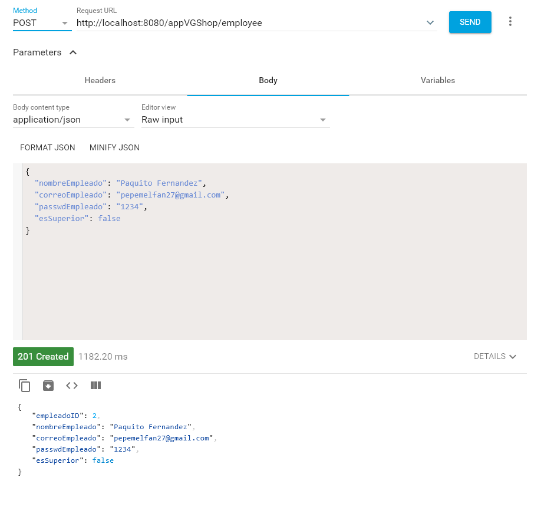

Una vez creado desde el ARC, vemos en el correo que ha llegado el mensaje correctamente.

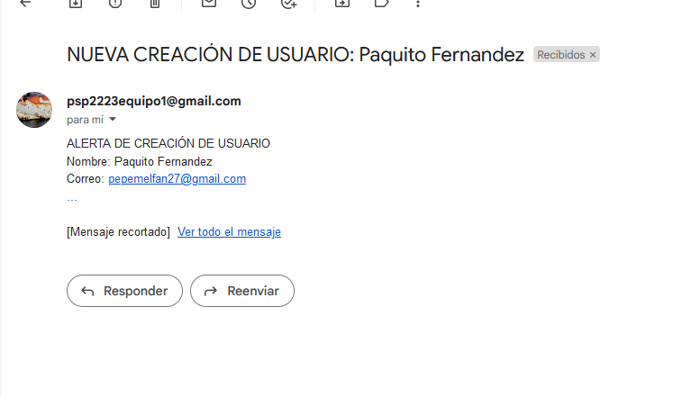

Ahora probaremos que efectivamente se ha creado el empleado correctamente, desde el ARC o Postman.

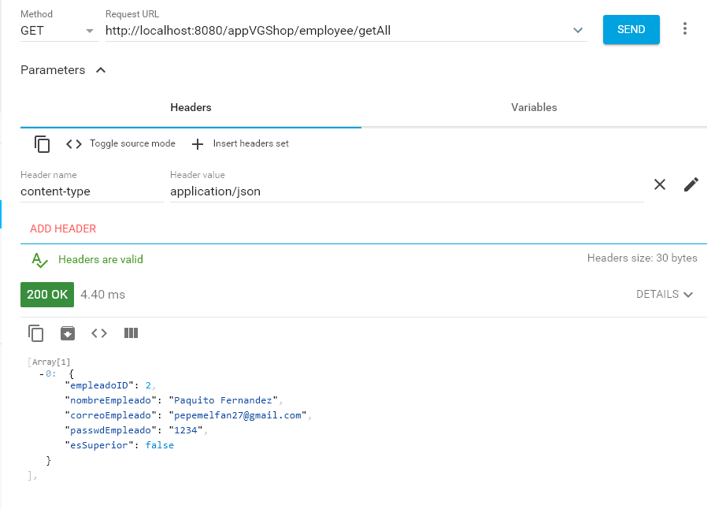

Ahora que tenemos un empleado que tratar, lo actualizaremos para probar que se envía un correo al actualizar. Hacemos la actualización correspondiente desde ARC o Postman.

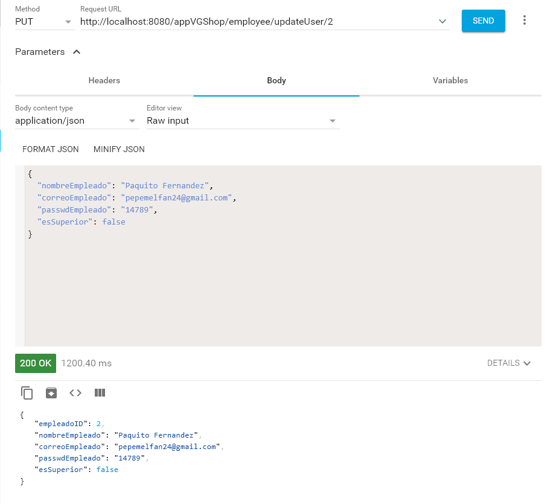

Una vez hecha, volveremos al correo y veremos que efectivamente ha llegado la notificación.

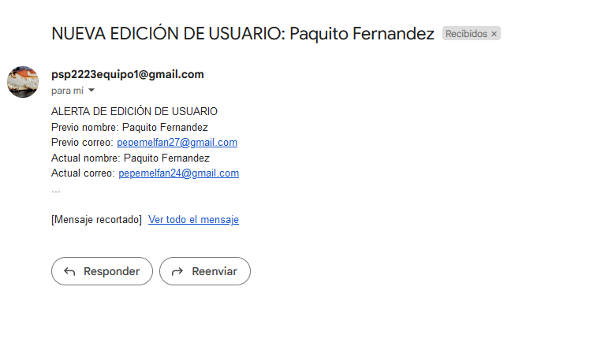

Probaremos que se ha hecho la actualización correctamente, desde el ARC o Postman.

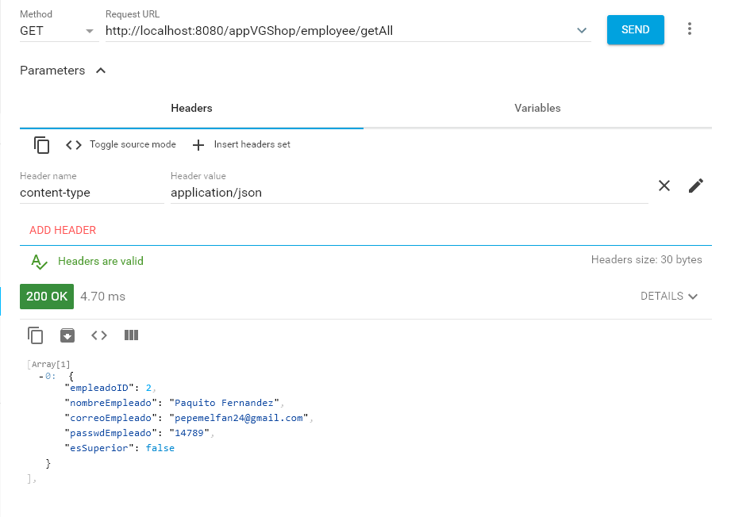

Y por último probaremos que nos manda un mensaje al eliminar. Para ello eliminaremos el empleado que hemos tratado previamente, de igual manera en el ARC o Postman.

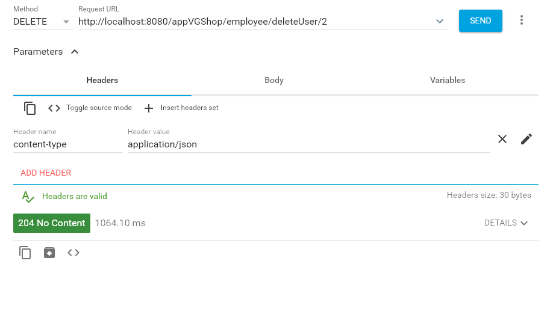

Efectivamente vemos que nos ha llegado la notificación al correo.

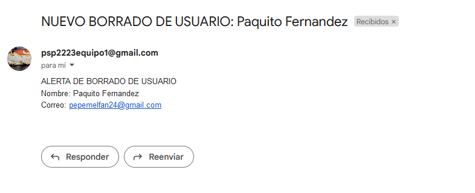

Y de igual manera probaremos que se ha eliminado correctamente.

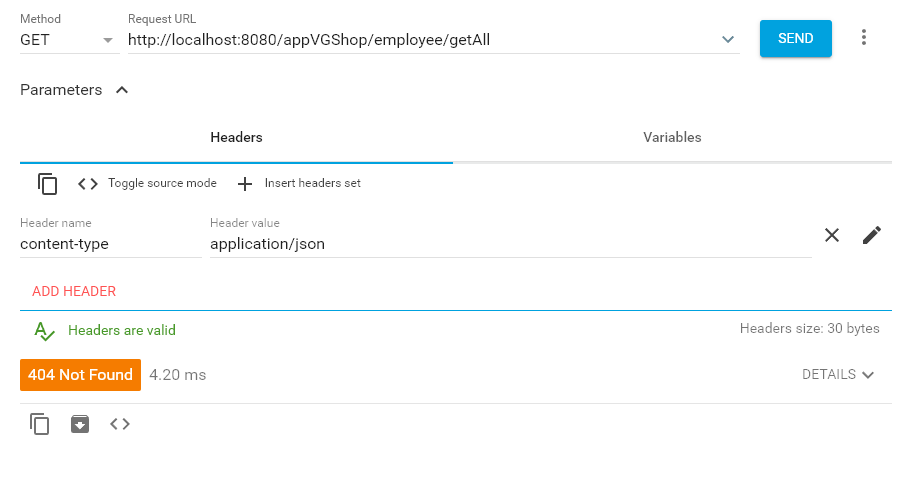

Ahora vemos desde la bandeja de entrada todos los correos que han llegado mientras nosotros tratábamos el empleado.

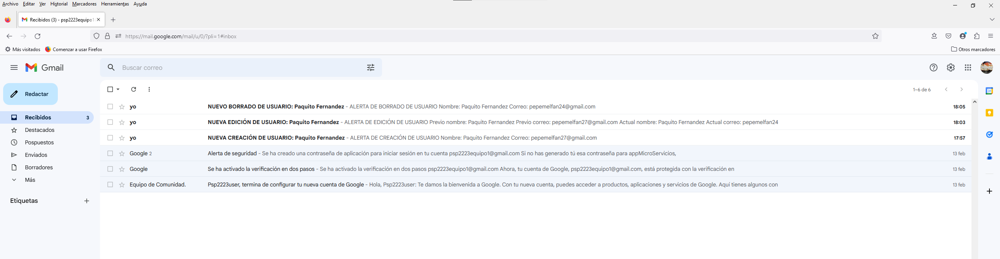

Después de todas las operaciones volvemos hacer el POST añadiendo el correo del profesor (jlrod2pruebas@gmail.com) y comprobamos que se ha enviado correctamente.

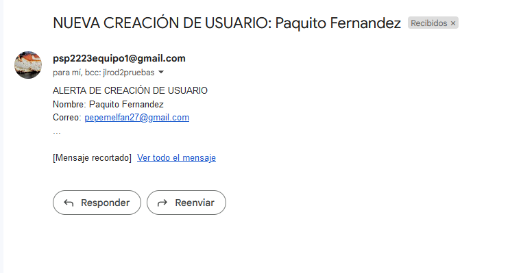